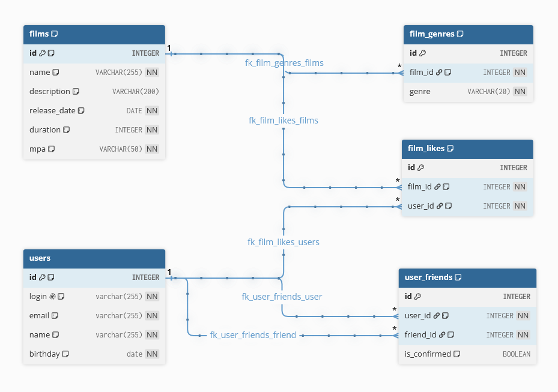

# База данных

## Схема БД


## Основные запросы
### Пользователь
#### Добавление пользователя
Параметры: login, email, name, birthday

```sql
INSERT INTO users (login, email, name, birthday) 
    VALUES ('alex_smith1', 'alex1@example.com', 'Alex Smith1', '1991-05-15');
```

#### Получение пользователя по Id
Параметр: id

```sql
SELECT id, login, email, name, birthday
FROM users
WHERE id = 1;
```

#### Обновление пользователя по Id
Параметр: id, атрибуты пользователя

```sql
UPDATE users
SET login='alex_smith1', email='alex1@example.com', name='Alex Smith1', birthday='1991-05-15'
WHERE id=1;
```

#### Получение всех пользователей

```sql
SELECT id, login, email, name, birthday
FROM users;
```

#### Добавление пользователя в друзья
Параметры: user_id, friend_id

```sql
INSERT INTO user_friends (user_id, friend_id) VALUES (1, 5);
```

#### Получение списка друзей пользователя по Id
Параметр: user_id

```sql
SELECT u.id as id,
       u.login as login,
       u.email as email,
       u.name as name,
       u.birthday as birthday
FROM user_friends as uf
         JOIN users as u ON uf.friend_id = u.id
WHERE uf.user_id = 1
```

### Фильм
#### Добавление фильма
Параметры: name, description, release_date, duration, mpa

```sql
INSERT INTO films (name, description, release_date, duration, mpa) VALUES
    ('The Great Adventure', 'An epic journey through time and space', '2023-06-15', 120, 'PG-13'),
```

#### Получение фильма по Id
Параметр: id

```sql
SELECT name, description, release_date, duration, mpa
FROM films
WHERE id = 1;
```

#### Обновление фильма по Id
Параметр: id, атрибуты фильма

```sql
UPDATE films
SET name='The Great Adventure', 
    description='An epic journey through time and space', 
    release_date='2023-06-15', 
    duration=120, 
    mpa='PG-13'
WHERE id=1;
```
#### Получение всех фильмов

```sql
SELECT id, name, description, release_date, duration, mpa
FROM films;
```

#### Поставить лайк фильму
Параметры: user_id, film_id

```sql
INSERT INTO film_likes (film_id, user_id) VALUES (2, 5);
```

#### Удалить лайк фильма
Параметры: user_id, film_id

```sql
DELETE FROM film_likes WHERE user_id = 2 AND film_id = 5;
```

#### Получение списка из первых count фильмов по количеству лайков
Параметры: count

```sql
select film_id
from film_likes
group by film_id
order by count(user_id) desc
    limit 10;
```

```sql
SELECT id, name, description, release_date, duration, mpa
FROM films
WHERE id IN (1, 2, 3, 4);
```


